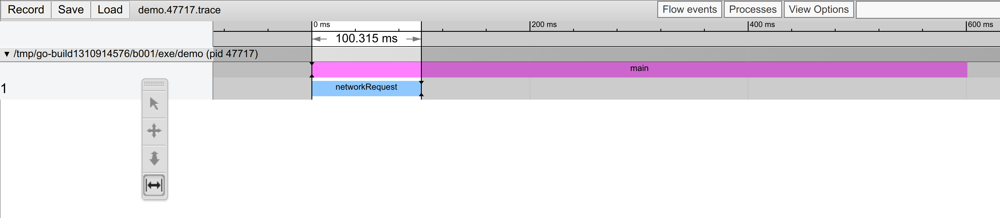

# chrometracing: chrome://tracing trace_event files

The chrometracing directory contains libraries for various programming languages
that make it easy to generate per-process trace files that can be loaded into
chrome://tracing.

## Implementation Status

Language | Status
---------|------------------------------
C++      | Work In Progress
Go       | Implemented: [github.com/google/chrometracing](https://pkg.go.dev/github.com/google/chrometracing)
Python   | Implemented, but not released
Java     | Work In Progress

## Go demo

See [the `_demo`
directory](https://github.com/google/chrometracing/tree/main/_demo) for an
example Go program.

After running the demo program, load the resulting chrome trace file from
[`os.TempDir()`](https://golang.org/pkg/os/#TempDir) (e.g. `/tmp` on Linux) into
`chrome://tracing`:

